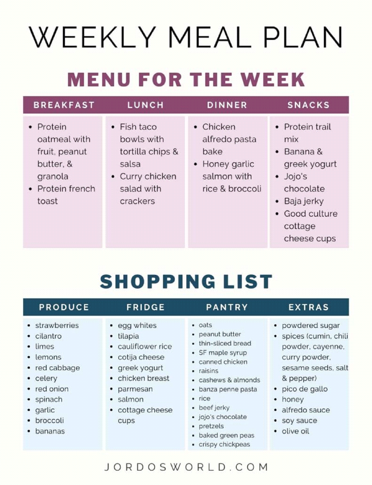

# Healthy Eating Meal Planner
an AI model that creates the best meal plan for you based on your preferences and dietary restrictions

## Idea
The main idea is to implement an application that uses model, which supplies the best meal plan to a user, based on his features (age, weight, height, diet, etc.). It will select the most nutritious food for the person and will create a sample diet of what the user should be eating to achieve his goal. The idea stays unique, as the person can not only put his body features, but also what he ate during the day/week. That way the model can compare the person diet with the generated meal plan and provide more tips/solutions to achieve his goal, with higher accuracy. The user can conveniently select foods from the application to validate his diet with the recommended one.

## Team
- 	David Lima Ruas van Rijthoven, ⦁	392425@student.fontys.nl
-	Alex A.B. Svetoslavov, a.svetoslavov@student.fontys.nl

## Problem Statement
To help shoppers make choices during grocery shopping that lead to a healthier lifestyle. An application can be made to take a user’s weight, age, height, and gender to generate an adequate meal plan. 
However, users will almost certainly not be able to match the meal plan exactly due to a variety of reasons such as local availability of food items or personal preference. For this reason, users will also be asked to input the food items they actually ate in a given day so these items can be compared to the food items suggested by the application.

A common problem with similar applications is that they often require the user to tediously input an exhaustive list of everything they’ve eaten for a certain period. To avoid this issue our application would allow users to input food items just by clicking different food images that have been filled in beforehand. It would also grow alongside its userbase, allowing certified users or food businesses to add food items and their nutritional contents for others to easily fill in.
## Data
https://www.kaggle.com/datasets/trolukovich/nutritional-values-for-common-foods-and-products

The dataset below contains macro and micro nutritional information about 8,800+ unique food items. Using this dataset as well as nutritionist guidelines for daily intake of these nutrients, a meal plan can be tailor made to an individual’s needs

## Ethical Check
TICT tool
### Appeal/Why is this interesting and innovative?
The application would learn to adapt to a user’s natural dietary choices and adjust its advice towards foods that are similar to what users already eat but that better fulfil the user’s nutritional needs.
### Ethical concerns
- By adjusting to a user’s natural diet, the algorithm could learn to enable a user’s harmful diet by progressively advising more and more similar food items.

